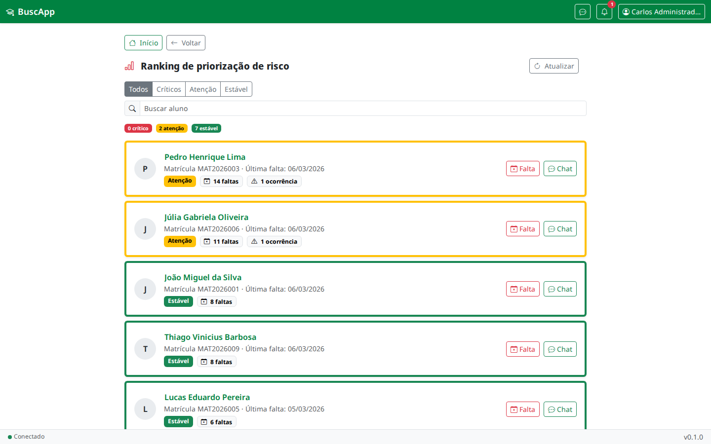
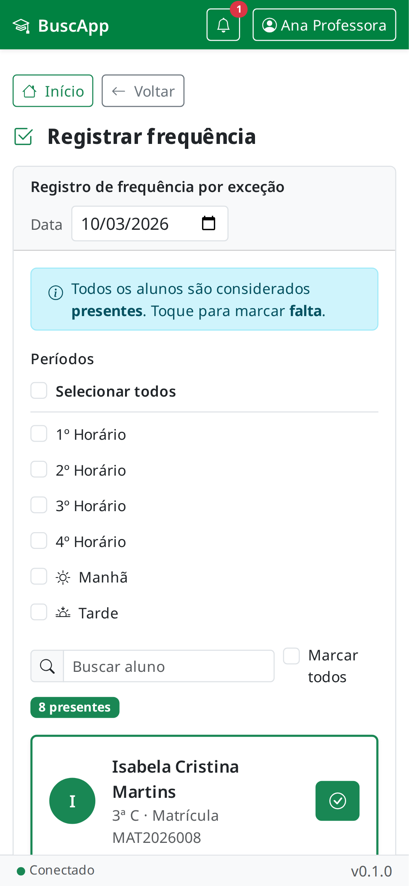
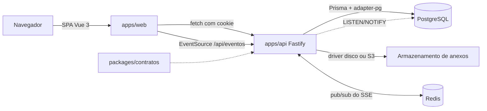

# BuscApp

[](https://github.com/eemtijca/buscapp/actions/workflows/qualidade.yml)
[](https://github.com/eemtijca/buscapp/actions/workflows/testes.yml)
[](https://github.com/eemtijca/buscapp/actions/workflows/codeql.yml)
[](LICENSE)



Plataforma web de gestão escolar para acompanhar frequência, ocorrências, justificativas de falta e a comunicação entre professores, gestão e responsáveis. Aplicação responsiva e instalável como PWA, com autenticação própria, isolamento de dados por perfil e atualização em tempo real.

Aplicação publicada em https://buscappjca.vercel.app.

<details>
<summary>Sumário</summary>

- [Demonstração](#demonstração)
- [Funcionalidades](#funcionalidades)
- [Stack](#stack)
- [Pré-requisitos](#pré-requisitos)
- [Começando](#começando)
- [Como usar](#como-usar)
- [Configuração](#configuração)
- [Arquitetura](#arquitetura)
- [Testes e qualidade](#testes-e-qualidade)
- [Deploy](#deploy)
- [Privacidade e dados](#privacidade-e-dados)
- [Segurança](#segurança)
- [Roadmap](#roadmap)
- [Perguntas frequentes](#perguntas-frequentes)
- [Documentação](#documentação)
- [Contribuindo](#contribuindo)
- [Suporte](#suporte)
- [Créditos](#créditos)
- [Licença](#licença)

</details>

## Demonstração

A aplicação publicada fica em https://buscappjca.vercel.app. O ambiente de desenvolvimento usa as credenciais do seed:

| Papel       | Email                | Senha     |
| ----------- | -------------------- | --------- |
| Gestão      | gestao@escola.edu.br | Admin123! |
| Professor   | prof1@escola.edu.br  | Prof123!  |
| Responsável | resp1@email.com      | Resp123!  |



## Funcionalidades

### Acesso e perfis

- Login sem cadastro público: os perfis são criados pela gestão e o primeiro acesso e a recuperação de senha usam um código de 6 dígitos gerado pela administração.
- Sessão por cookie `HttpOnly` com papéis `professor`, `gestao` e `responsavel`, além de módulos de acesso por perfil.
- Redefinição de senha com política forte, revogação de sessões e trilha de auditoria dos códigos.

### Plataforma

- SPA Vue 3 mobile-first, instalável como PWA, com indicador de conexão e recuperação após quedas de rede.
- Atualização em tempo real por Server-Sent Events, sem recarregar a tela.
- Mensagens de erro em português, com validação no cliente e no servidor.

### Módulo professor

- Frequência por exceção: registra apenas os ausentes, desfaz o lançamento do período e mantém histórico por aluno.
- Registro de ausência individual e de ocorrências, com tags de comportamento e anexos.
- Acesso condicionado aos módulos liberados pela gestão.

### Módulo gestão

- Painel com ranking de priorização de risco dos alunos e infrequências, a partir do termômetro de risco.
- Central de ocorrências, com confirmação de presença do responsável e registro pela própria gestão.
- Fila de justificativas, com aceite que auto-justifica as frequências ou recusa com parecer.
- Gestão de usuários, códigos, alunos, turmas, anos letivos, disciplinas, atribuições e enturmações.
- Chat com os responsáveis.
- Configurações do sistema, catálogos, tags de comportamento e horários de atendimento.

### Módulo responsável

- Alertas e termômetro de risco dos dependentes.
- Envio de justificativas com anexos.
- Chat com a escola, com horário protegido no servidor.

### Em desenvolvimento

- Gamificação entre turmas (tabelas de pontuação prontas, frontend não conectado).
- Notificações push.

## Stack

- Frontend: Vue 3 com TypeScript, Vite, Vue Router, Bootstrap 5, Bootstrap Icons e `vite-plugin-pwa`.
- Backend: Node.js com Fastify 5, Zod e `fastify-type-provider-zod`.
- Dados: PostgreSQL 15 ou superior com Prisma 7.10 e `@prisma/adapter-pg`, incluindo RLS como segunda barreira de isolamento.
- Autenticação: scrypt, sessão opaca em cookie `HttpOnly` e códigos de redefinição com HMAC.
- Tempo real: Server-Sent Events em `/api/eventos`.
- Anexos: drivers de disco e S3, com upload direto por URL pré-assinada.
- Infraestrutura: Docker, Docker Compose, imagem no GHCR e Vercel Services para o perfil full-stack.
- Qualidade: Vitest, Playwright, oxlint, ESLint, Prettier, GitHub Actions e CodeQL.

## Pré-requisitos

- Node 20.19 ou superior, ou 22.12 ou superior.
- Docker com Compose no modo recomendado.
- PostgreSQL 15 ou superior próprio, como alternativa ao Compose.

## Começando

### Docker Compose

```bash
cp .env.example .env
# Preencha AUTH_PEPPER com pelo menos 32 caracteres
npm run compose:up
npm run seed -w @buscapp/api
```

A aplicação fica em `http://localhost:3000`, com o PostgreSQL em `localhost:5433`. As migrações são aplicadas na partida e o driver de disco guarda os anexos no volume `uploads`.

### Sem Docker

Instruções completas, incluindo Supabase e banco gerenciado, estão em [docs/ambiente.md](docs/ambiente.md).

### Credenciais de desenvolvimento

As credenciais do seed são as mesmas da seção de demonstração. O seed cria turmas, alunos, frequências e ocorrências de exemplo para exercitar os três perfis.

## Como usar

1. A gestão cria os perfis, gera os códigos de primeiro acesso e entrega a cada pessoa.
2. O professor entra, escolhe a turma e o dia e registra apenas as faltas da chamada.
3. A gestão acompanha o ranking de risco, a fila de justificativas e as ocorrências.
4. O responsável recebe alertas, envia justificativas e conversa com a escola pelo chat.

## Configuração

As variáveis são validadas com Zod na partida da API. As principais:

| Variável                | Papel                                                                 |
| ----------------------- | --------------------------------------------------------------------- |
| `DATABASE_URL`          | Conexão de runtime com o papel restrito sujeito ao RLS.               |
| `MIGRATE_DATABASE_URL`  | Conexão dona do schema, usada por migrações, seed e rotinas de admin. |
| `AUTH_PEPPER`           | Pepper do HMAC dos códigos de redefinição.                            |
| `REDIS_URL`             | Redis do pub/sub do SSE, obrigatória em todos os ambientes.           |
| `STORAGE_DRIVER`        | Driver de anexos, `disco` ou `s3`.                                    |
| `TZ_ESCOLA`             | Fuso IANA da escola para horários e datas civis.                      |

A referência completa está em [docs/ambiente.md](docs/ambiente.md).

## Arquitetura

Monorepo npm workspaces com a SPA Vue 3 (`apps/web`), a API Fastify 5 (`apps/api`) e os contratos Zod (`packages/contratos`). A topologia padrão é de mesma origem: a API serve o build da SPA e mantém o cookie de sessão first-party.



As camadas, o fluxo de uma requisição autenticada e as decisões registradas estão em [docs/arquitetura.md](docs/arquitetura.md) e [docs/adr/](docs/adr/).

## Testes e qualidade

| Comando                     | Efeito                                                         |
| --------------------------- | -------------------------------------------------------------- |
| `npm run type-check`        | Verificação de tipos de todos os workspaces.                   |
| `npm run lint`              | oxlint e ESLint com correção automática.                       |
| `npm run test:unit`         | Guarda editorial, integração da API e unidade do web.          |
| `npm run test:e2e`          | Playwright local com API e SPA de desenvolvimento.             |
| `npm run test:e2e:docker`   | Playwright na imagem oficial, com o aplicativo no ar.          |
| `npm run test:pwa:docker`   | PWA contra o build de produção.                                |
| `npm run test:db`           | Smoke test do schema no PostgreSQL do Compose.                 |
| `npm run capturas:readme`   | Regenera as capturas do README em `docs/imagens/`.             |

A convenção das suítes está em [docs/testes.md](docs/testes.md) e [tests/README.md](tests/README.md).

## Deploy

> [!NOTE]
> A implantação na Vercel está pausada; a publicação de imagem no GHCR segue ativa, por dispatch manual. O passo a passo de reativação está em [docs/portabilidade.md](docs/portabilidade.md).

O perfil full-stack usa Vercel Services, com a SPA servida pela API, Redis para o SSE e `DB_POOL_MAX=1`. O passo a passo, as variáveis de produção e o workflow de migrações estão em [docs/deploy.md](docs/deploy.md).

## Privacidade e dados

O aplicativo trata cadastro escolar, frequência, ocorrências, justificativas e mensagens de chat, sempre no escopo do papel autenticado, com RLS como segunda barreira no banco. A exportação e a anonimização dos dados do titular seguem o [ADR-014](docs/adr/014-lgpd-exportacao-e-anonimizacao.md). O repositório não contém dados reais; a massa de desenvolvimento e dos testes é sintética.

## Segurança

Vulnerabilidades são reportadas em issue privada ou security advisory, nunca em issue pública. Os controles, as decisões e as lacunas conhecidas estão em [docs/seguranca.md](docs/seguranca.md) e a política de reporte em [SECURITY.md](SECURITY.md).

## Roadmap

- Gamificação entre turmas, com as tabelas de pontuação prontas e o frontend ainda não conectado.
- Notificações push.

## Perguntas frequentes

**O BuscApp é gratuito?**
Sim, é de código aberto sob licença MIT.

**Preciso de e-mail para criar conta?**
Não. Não há cadastro público: a gestão cria os perfis e o primeiro acesso usa um código de 6 dígitos entregue pela escola.

**Os dados de uma escola ficam isolados dos demais perfis?**
Sim. Toda consulta é filtrada por papel, módulo e escopo na API, com RLS como segunda barreira no banco.

**Funciona instalado no celular?**
Sim. A aplicação é um PWA instalável, com indicador de conexão e recuperação após quedas de rede.

**Como rodo o projeto sem Docker?**
Com um PostgreSQL próprio e Node instalado, conforme [docs/ambiente.md](docs/ambiente.md).

**Onde reporto um problema?**
Em uma issue no GitHub. Vulnerabilidades seguem o [SECURITY.md](SECURITY.md).

## Documentação

| Documento                                          | Conteúdo                                             |
| -------------------------------------------------- | ---------------------------------------------------- |
| [docs/README.md](docs/README.md)                   | Índice completo da documentação                      |
| [docs/ambiente.md](docs/ambiente.md)               | Variáveis de ambiente e execução local               |
| [docs/arquitetura.md](docs/arquitetura.md)         | Camadas, fluxo de requisição e organização do código |
| [docs/banco.md](docs/banco.md)                     | Migrações, papéis, RLS e retenção                    |
| [docs/api.md](docs/api.md)                         | Referência das rotas HTTP                            |
| [docs/modelo-de-dados.md](docs/modelo-de-dados.md) | Entidades, enums e glossário                         |
| [docs/modulos.md](docs/modulos.md)                 | Regras de cada módulo e módulos de acesso            |
| [docs/interface.md](docs/interface.md)             | Design system, rotas, componentes e acessibilidade   |
| [docs/operacao.md](docs/operacao.md)               | Runbooks, reset e resolução de problemas             |
| [docs/testes.md](docs/testes.md)                   | Suítes, convenções e integração contínua             |
| [docs/seguranca.md](docs/seguranca.md)             | Controles, decisões e lacunas conhecidas             |
| [docs/deploy.md](docs/deploy.md)                   | Compose, Vercel e migrações de produção              |
| [docs/adr/](docs/adr/)                             | Decisões de arquitetura registradas                  |
| [CONTRIBUTING.md](CONTRIBUTING.md)                 | Rotina de desenvolvimento e padrões                  |
| [CODE_OF_CONDUCT.md](CODE_OF_CONDUCT.md)           | Normas de convivência da comunidade                  |
| [SECURITY.md](SECURITY.md)                         | Política de reporte de vulnerabilidades              |
| [CHANGELOG.md](CHANGELOG.md)                       | Histórico de mudanças do projeto                     |

## Contribuindo

Leia o [CONTRIBUTING.md](CONTRIBUTING.md) antes de propor mudanças. Issues e pull requests usam etiquetas de tipo e de área, commits atômicos em um único pull request e abertura somente com o trabalho finalizado. Agentes de IA seguem o [AGENTS.md](AGENTS.md).

## Suporte

Dúvidas e problemas são bem-vindos nas [issues do repositório](https://github.com/eemtijca/buscapp/issues). Para vulnerabilidades, use o canal privado descrito no [SECURITY.md](SECURITY.md).

## Créditos

Projeto mantido pela equipe do BuscApp na EEMTI José Cláudio de Araújo.

## Licença

Este projeto é desenvolvido sob licença MIT para fomentar a tecnologia educacional pública. Consulte o arquivo [LICENSE](LICENSE).
