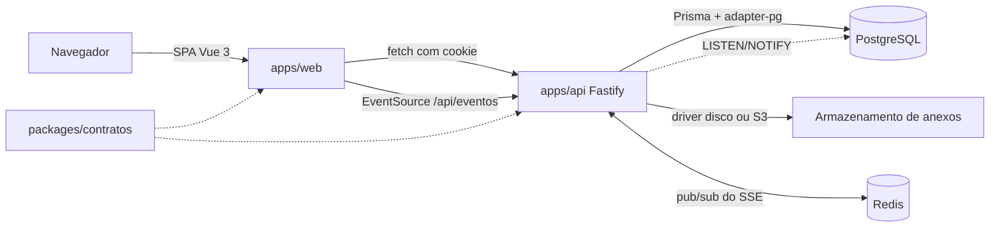
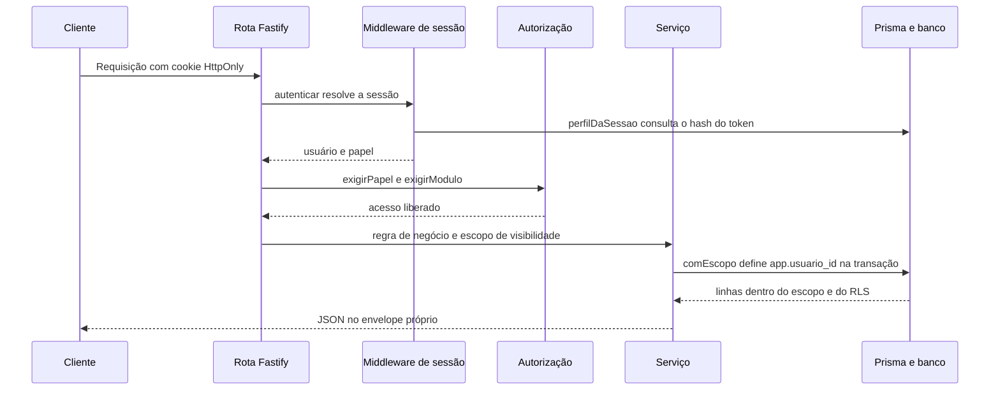

# Arquitetura

Monorepo npm workspaces com três pacotes: a SPA Vue 3 (`apps/web`), a API Fastify 5 (`apps/api`) e os contratos Zod compartilhados (`packages/contratos`). O PostgreSQL é acessado via Prisma 7.10 com `@prisma/adapter-pg`. A topologia padrão é de mesma origem: a API serve o build da SPA, o que mantém o cookie de sessão first-party.

## Visão geral



## Camadas

- `apps/web/src/servicos/api.ts`: cliente HTTP tipado único, com `credentials: 'include'`, envelope de erro `ErroApi` e suporte a FormData.
- `apps/web/src/servicos/eventos.ts`: conexão SSE única por aba, com assinatura por tabela e status da conexão.
- `apps/api/src/aplicacao.ts`: fábrica Fastify, testável com `inject`. Registra cookie, CORS, multipart, rotas e, quando existe `WEB_DIST`, o `@fastify/static` com fallback da SPA.
- `apps/api/src/server.ts`: entrada do processo. Instancia a aplicação com `construirApp()` e chama `listen()`.
- `apps/api/src/ambiente.ts`: validação Zod das variáveis, com falha antecipada.
- `apps/api/src/nucleo/`: infraestrutura transversal (`banco`, `autenticacao`, `autorizacao`, `armazenamento`, `auditoria`, `eventos`, `http`, `rate-limit` e `tempo`).
- `apps/api/src/modulos/<dominio>/`: padrão `.rotas.ts`, `.servico.ts` e `.repositorio.ts`.
- `packages/contratos/src/`: schemas Zod de entrada e saída por domínio, compartilhados entre API e frontend.
- `tests/`: Playwright e helpers de apoio. Os testes de integração da API ficam no próprio módulo, em `apps/api/src/**/*.test.ts`.

## Fluxo de uma requisição autenticada



O token de sessão tem 32 bytes aleatórios e só existe no cookie; o banco guarda o SHA-256. A validade é de 12 horas, ou 30 dias com `lembrar`. Logout, inativação e redefinição de senha revogam as sessões. Detalhes em [seguranca.md](seguranca.md).

## Isolamento entre perfis

Duas camadas independentes:

1. A API filtra por papel, módulo e escopo em cada serviço (`nucleo/autorizacao/escopo.ts`): gestão vê todos os alunos, professor vê as turmas em que leciona e responsável vê apenas os alunos vinculados.
2. O banco aplica RLS com o papel restrito `buscapp_api` e `app.usuario_id` definido por transação, funcionando como backstop de erros de escopo. Ver [ADR-003](adr/003-rls-backstop.md).

Leituras fora do escopo respondem 404, para não revelar a existência do registro.

## Tempo real

O stream `GET /api/eventos` usa Server-Sent Events e publica eventos de invalidação `{ tabela, escopo }`, sem dados sensíveis. O barramento distribui os eventos por Redis pub/sub, com fallback de `LISTEN/NOTIFY` do PostgreSQL, e heartbeat de 25 segundos; o cache do cliente invalida as consultas inscritas na tabela, revalidando ao reconectar, ao voltar para a aba e ao voltar a rede. A conexão é aberta apenas com sessão ativa e encerrada no logout. Ver [ADR-005](adr/005-tempo-real-sse.md), [ADR-010](adr/010-rate-limiting-e-pubsub-com-fallback.md) e [modulos.md](modulos.md).

## Cache de dados do cliente

O estado remoto fica em `apps/web/src/servicos/cache.ts`, com `stale-while-revalidate`: dados retidos aparecem de imediato e são revalidados em segundo plano, com deduplicação de requisições e invalidação por tabela do SSE. `apps/web/src/servicos/persistenciaCache.ts` guarda no IndexedDB uma lista explícita de consultas, com namespace por usuário, validade e purga no logout. `apps/web/src/servicos/prefetch.ts` aquece as consultas da rota na intenção de navegação. A API responde `/api` com `Cache-Control: private, no-store` e ETag próprio; a revalidação envia `If-None-Match` e aceita `304`. Ver [ADR-008](adr/008-cache-de-dados-cliente.md) e [interface.md](interface.md).

## Topologia

| Perfil              | Frontend         | API                | Cookie           |
| ------------------- | ---------------- | ------------------ | ---------------- |
| Compose e self-host | servida pela API | mesmo processo     | first-party      |
| Desenvolvimento     | Vite em `:5173`  | Fastify em `:3001` | CORS credenciado |
| Vercel SPA separada | projeto estático | outro host         | CORS credenciado |
| Vercel Services     | serviço `web`    | serviço `api`      | first-party      |

Quando a SPA está em outro host, basta definir `VITE_API_URL` e liberar a origem em `APP_ORIGINS`. Ver [deploy.md](deploy.md).

## Organização de diretórios

```
apps/
  web/
    src/
      assets/            tokens de cor e fontes
      componentes/       componentes reutilizáveis
      composables/       estado, view models de consulta e orquestração
        consultas/       hooks derivados do cache por domínio
      layouts/           shell da aplicação
      paginas/           auth, professor, gestao, responsavel e error
      rotas/             Vue Router com guardas de papel e módulo
      servicos/          cliente da API com ETag, cache, IndexedDB, EventSource e termômetro
      tipos/             tipos do banco e de componentes
      utils/             compressão de imagem, mensagens e formatação
  api/
    prisma/
      schema.prisma      contrato do banco
      migrations/        onze migrações SQL
      seeds/dev.ts       fixtures de desenvolvimento
    src/
      ambiente.ts        validação das variáveis
      aplicacao.ts       fábrica Fastify
      server.ts          entrada do processo
      nucleo/            banco, autenticação, autorização, armazenamento, auditoria, eventos, http, rate-limit e tempo
      modulos/<dominio>/ rotas, serviço e repositório por domínio
packages/contratos       schemas Zod compartilhados
tests/e2e                Playwright
tests/suporte            helpers de API, banco, fixtures e sessão
infra/docker             Dockerfile, entrypoint e preparação do papel
docs/                    esta documentação
```

## Decisões registradas

- [ADR-001: Prisma 7 com driver adapter pg](adr/001-prisma-v7.md)
- [ADR-002: autenticação própria com sessão opaca e códigos HMAC](adr/002-autenticacao-propria.md)
- [ADR-003: isolamento por papel com RLS de barreira](adr/003-rls-backstop.md)
- [ADR-004: anexos atrás de interface, com upload direto](adr/004-anexos-armazenamento.md)
- [ADR-005: tempo real por Server-Sent Events](adr/005-tempo-real-sse.md)
- [ADR-006: mesma origem e perfis de implantação](adr/006-same-origin-e-perfis.md)
- [ADR-007: sonda de sessão sem 401 em GET /api/auth/me](adr/007-sonda-de-sessao-sem-401.md)
- [ADR-008: cache de dados do cliente com IndexedDB e ETag](adr/008-cache-de-dados-cliente.md)
- [ADR-009: RLS e privilégios de coluna nas tabelas administrativas](adr/009-rls-e-privilegios-administrativos.md)
- [ADR-010: rate limiting no Postgres e pub/sub com fallback](adr/010-rate-limiting-e-pubsub-com-fallback.md)
- [ADR-011: fuso horário da escola no servidor](adr/011-fuso-horario-da-escola.md)
- [ADR-012: cabeçalhos de segurança e verificação de origem](adr/012-cabecalhos-de-seguranca-e-origem.md)
- [ADR-013: retenção e expurgo agendado](adr/013-retencao-e-expurgo-agendado.md)
- [ADR-014: exportação e anonimização de dados do titular](adr/014-lgpd-exportacao-e-anonimizacao.md)
