# Modelo de dados

Descrição das entidades persistidas e do vocabulário do domínio. O schema é a fonte da verdade em `apps/api/prisma/schema.prisma`; este documento explica a intenção de cada tabela e campo.

## Entidades

```mermaid
erDiagram
  perfis ||--o{ sessoes : abre
  perfis ||--o{ codigos_redefinicao : recebe
  perfis ||--o{ atribuicoes_professores : leciona
  perfis ||--o{ vinculos_responsaveis : responde
  perfis ||--o{ frequencias : registra
  perfis ||--o{ ocorrencias : registra
  perfis ||--o{ registros_comportamento : registra
  perfis ||--o{ justificativas_faltas : envia
  perfis ||--o{ justificativas_faltas : avalia
  perfis ||--o{ conversas : responde
  perfis ||--o{ mensagens : envia
  perfis ||--o{ anexos : cria
  perfis ||--o{ notificacoes : recebe
  perfis ||--o{ monitoramento_acoes : acompanha
  alunos ||--o{ enturmacoes : cursa
  alunos ||--o{ frequencias : possui
  alunos ||--o{ justificativas_faltas : possui
  alunos ||--o{ ocorrencias : possui
  alunos ||--o{ vinculos_responsaveis : possui
  alunos ||--o{ registros_comportamento : possui
  alunos ||--o{ conversas : origina
  alunos ||--o{ monitoramento_acoes : alvo
  turmas ||--o{ enturmacoes : agrupa
  turmas ||--o{ atribuicoes_professores : recebe
  turmas ||--o{ conversas : abriga
  turmas ||--o{ registros_comportamento : agrupa
  turmas ||--o{ pontuacao_turmas : pontua
  anos_letivos ||--o{ turmas : organiza
  anos_letivos ||--o{ frequencias : organiza
  anos_letivos ||--o{ registros_comportamento : organiza
  anos_letivos ||--o{ pontuacao_turmas : referencia
  disciplinas ||--o{ atribuicoes_professores : compoe
  disciplinas ||--o{ registros_comportamento : opcional
  frequencias ||--o{ justificativas_faltas : justifica
  conversas ||--o{ mensagens : contem
  ocorrencias ||--o{ ocorrencia_anexos : usa
  justificativas_faltas ||--o{ justificativa_anexos : usa
  anexos ||--o{ ocorrencia_anexos : compoe
  anexos ||--o{ justificativa_anexos : compoe
  registros_comportamento ||--o{ registro_comportamento_tags : marca
  tags_comportamento ||--o{ registro_comportamento_tags : aplica
```

> [!NOTE]
> O diagrama cobre as entidades de domínio e as de apoio mais relevantes. Tabelas puramente operacionais (`rate_limit_contadores`, `codigos_redefinicao_tentativas`, `convites`, `importacoes_log` e `exportacoes`) aparecem nas seções abaixo, mas foram omitidas do diagrama por não terem relações de domínio.

### Perfis

Perfis de usuário, com credenciais, papel e módulos de acesso. É a entidade referenciada por quase todas as demais.

| Campo                      | Tipo        | Observação                                           |
| -------------------------- | ----------- | ---------------------------------------------------- |
| `id`                       | uuid        | Chave primária                                       |
| `nome`                     | text        | Nome exibido                                         |
| `email`                    | text        | Único, pode ser nulo em perfis sem login             |
| `papel`                    | enum        | `professor`, `gestao` ou `responsavel`               |
| `status`                   | enum        | `ativo`, `pendente` ou `inativo`                     |
| `senha_hash`               | text        | `scrypt$N$r$p$salHex$chaveHex` ou hash bcrypt legado |
| `senha_alterada_em`        | timestamptz | Última troca de senha                                |
| `acesso_modulos`           | text[]      | Módulos liberados para professor e responsável       |
| `permissoes`               | text[]      | Reservado para permissões finas                      |
| `notificacoes_ativas`      | boolean     | Preferência de notificação                           |
| `telefone`, `cargo`        | text        | Dados complementares                                 |
| `ultimo_acesso_em`         | timestamptz | Último login                                         |
| `created_at`, `updated_at` | timestamptz | Auditoria                                            |

### Alunos

Alunos identificados por nome e matrícula, sem CPF ou endereço.

| Campo                                                                      | Tipo        | Observação                                     |
| -------------------------------------------------------------------------- | ----------- | ---------------------------------------------- |
| `id`                                                                       | uuid        | Chave primária                                 |
| `nome`                                                                     | text        | Nome do aluno                                  |
| `matricula`                                                                | text        | Única                                          |
| `codigo_inep`                                                              | text        | Código INEP opcional                           |
| `status`                                                                   | enum        | `ativo`, `egresso`, `transferido` ou `inativo` |
| `data_nascimento`, `data_matricula`                                        | date        | Datas civis opcionais                          |
| `transporte_escolar`, `alimentacao_diferenciada`, `necessidades_especiais` | boolean     | Indicadores                                    |
| `documentos_recebidos`                                                     | text[]      | Documentos entregues                           |
| `observacoes`                                                              | text        | Observações gerais                             |
| `created_at`, `updated_at`                                                 | timestamptz | Auditoria                                      |

### Estrutura escolar

| Entidade                  | Campos principais                                                                             | Observação                                                                             |
| ------------------------- | --------------------------------------------------------------------------------------------- | -------------------------------------------------------------------------------------- |
| `anos_letivos`            | `ano` único, `status` (`planejado`, `ativo`, `arquivado`), `data_inicio`, `data_fim`, `ativo` | Apenas um ano ativo por vez, garantido pela virada de ano e pelo índice único parcial. |
| `turmas`                  | `ano_letivo_id`, `serie`, `letra`, `nome_completo`, `capacidade`, `ativo`                     | `nome_completo` é preenchido por trigger a partir de série e letra.                    |
| `disciplinas`             | `nome`, `codigo_sige` único, `carga_horaria`, `ativo`                                         | `codigo_sige` apoia integração com a SEDUC.                                            |
| `enturmacoes`             | `aluno_id`, `turma_id`, `ano_letivo_id`, `status`, `data_matricula`, `data_encerramento`      | Única por aluno e ano.                                                                 |
| `atribuicoes_professores` | `professor_id`, `turma_id`, `disciplina_id`, `papel` (`titular` ou `substituto`), vigência    | Define o escopo do professor.                                                          |
| `vinculos_responsaveis`   | `responsavel_id`, `aluno_id`, `tipo_relacao`, `contato_prioritario`, `ativo`                  | Único por par responsável e aluno.                                                     |

### Frequência

| Campo               | Tipo        | Observação                                  |
| ------------------- | ----------- | ------------------------------------------- |
| `id`                | uuid        | Chave primária                              |
| `aluno_id`          | uuid        | Aluno                                       |
| `professor_id`      | uuid        | Registrante                                 |
| `turma_id`          | uuid        | Turma                                       |
| `disciplina_id`     | uuid        | Opcional                                    |
| `ano_letivo_id`     | uuid        | Ano letivo                                  |
| `data_aula`         | date        | Data civil                                  |
| `tipo_registro`     | enum        | `chamada_aula`, `entrada_portao` ou `saida` |
| `periodo`           | text        | Período da aula                             |
| `status`            | enum        | `presente`, `ausente` ou `justificado`      |
| `motivos_ausencia`  | text[]      | Motivos do catálogo                         |
| `client_request_id` | uuid        | Idempotência, único                         |
| `deleted_at`        | timestamptz | Soft delete do desfazer do lote             |

O índice `idx_frequencias_unicidade` garante um registro por aluno, data, tipo, período e disciplina enquanto não houver soft delete.

### Ocorrências e comportamento

| Entidade                      | Campos principais                                                                                                                                                                                                                                                                            | Observação                                 |
| ----------------------------- | -------------------------------------------------------------------------------------------------------------------------------------------------------------------------------------------------------------------------------------------------------------------------------------------- | ------------------------------------------ |
| `ocorrencias`                 | `aluno_id`, `professor_id`, `coordenador_id`, `turma_id`, `ano_letivo_id`, `titulo`, `descricao`, `tipo[]`, `status`, `exige_presenca_responsavel`, `presenca_responsavel_confirmada`, `data_confirmacao_presenca`, `tags_comportamento[]`, `notificar_coordenacao`, `notificar_responsavel` | Workflow de status e flags de notificação. |
| `ocorrencia_anexos`           | `ocorrencia_id`, `anexo_id`                                                                                                                                                                                                                                                                  | Associação N:N.                            |
| `registros_comportamento`     | `aluno_id`, `professor_id`, `turma_id`, `disciplina_id`, `data_hora`, `observacao`, `client_request_id`                                                                                                                                                                                      | Registros positivos e negativos.           |
| `registro_comportamento_tags` | `registro_id`, `tag_id`                                                                                                                                                                                                                                                                      | Associação N:N.                            |
| `tags_comportamento`          | `nome` único, `categoria` (`positivo`, `atencao`, `critico`), `peso_pontuacao`, `ativo`                                                                                                                                                                                                      | Alimenta a pontuação e o termômetro.       |

### Justificativas

| Campo                                    | Tipo                      | Observação                                           |
| ---------------------------------------- | ------------------------- | ---------------------------------------------------- |
| `id`                                     | uuid                      | Chave primária                                       |
| `responsavel_id`                         | uuid                      | Autor                                                |
| `aluno_id`                               | uuid                      | Aluno                                                |
| `frequencia_id`                          | uuid                      | Opcional, quando vinculada a uma ausência específica |
| `data_falta`, `data_fim`                 | date                      | Suporta múltiplos dias                               |
| `motivo`                                 | text                      | Texto do responsável                                 |
| `status`                                 | enum                      | `pendente`, `aceita` ou `recusada`                   |
| `avaliado_por`, `avaliado_em`, `parecer` | uuid e timestamptz e text | Avaliação da gestão                                  |
| `justificativa_anexos`                   | N:N                       | Anexos comprobatórios                                |

### Chat

| Entidade    | Campos principais                                                                                                         | Observação                                                                 |
| ----------- | ------------------------------------------------------------------------------------------------------------------------- | -------------------------------------------------------------------------- |
| `conversas` | `turma_id`, `responsavel_id`, `aluno_id`, `assunto`, `ativa`, `iniciada_pela_gestao`, `ultima_mensagem_em`                | Única por par responsável e aluno.                                         |
| `mensagens` | `conversa_id`, `remetente_id`, `conteudo`, `is_system_message`, `lida_em`, `edited_at`, `deleted_at`, `client_request_id` | Idempotência por `client_request_id`; mensagens de sistema marcam eventos. |

### Anexos e armazenamento

| Campo           | Tipo        | Observação                                                     |
| --------------- | ----------- | -------------------------------------------------------------- |
| `id`            | uuid        | Chave primária                                                 |
| `storage_path`  | text        | Chave no driver de armazenamento, prefixada pelo id do criador |
| `nome_arquivo`  | text        | Nome original                                                  |
| `mime_type`     | text        | JPEG, PNG, WEBP ou PDF                                         |
| `tamanho_bytes` | int         | Até 10 MB (CHECK)                                              |
| `criado_por`    | uuid        | Perfil criador                                                 |
| `expurgo_em`    | timestamptz | Padrão de 30 dias, aplicado pelo expurgo agendado              |
| `expurgado_em`  | timestamptz | Reservado, sem rotina que o preencha                           |
| `processado_em` | timestamptz | Marcado quando a imagem é reprocessada no servidor             |

### Notificações, monitoramento e pontuação

| Entidade              | Campos principais                                                                                        | Observação                                                                              |
| --------------------- | -------------------------------------------------------------------------------------------------------- | --------------------------------------------------------------------------------------- |
| `notificacoes`        | `destinatario_id`, `tipo`, `titulo`, `corpo`, `metadados`, `lida`, `lida_em`, `dedupe_key`               | Tipos: ausências, monitoramento, ocorrência, justificativa, mensagem, sistema e código. |
| `monitoramento_acoes` | `aluno_id`, `responsavel_id`, `tipo_contato`, `status`, `observacao`, `agendado_para`, `realizado_em`    | Registro das tentativas de contato.                                                     |
| `pontuacao_turmas`    | `turma_id`, `ano_letivo_id`, `mes_referencia`, `pontos_presenca`, `pontos_comportamento`, `pontos_total` | `pontos_total` é coluna gerada.                                                         |

### Autenticação

| Entidade                         | Campos principais                                                                                | Observação                                                               |
| -------------------------------- | ------------------------------------------------------------------------------------------------ | ------------------------------------------------------------------------ |
| `sessoes`                        | `perfil_id`, `token_hash` único, `expira_em`, `revogada_em`, `ultimo_uso_em`, `user_agent`, `ip` | O banco guarda apenas o SHA-256 do token.                                |
| `codigos_redefinicao`            | `email`, `perfil_id`, `codigo_hash`, `criado_por`, `expira_em`, `usado_em`, `revogado_em`        | HMAC-SHA256; a coluna legada `codigo` não é usada.                       |
| `codigos_redefinicao_tentativas` | `email` (chave), `tentativas`, `bloqueado_ate`                                                   | Bloqueio temporário por email.                                           |
| `auditoria`                      | `usuario_id`, `acao`, `entidade`, `entidade_id`, `dados_anteriores`, `dados_novos`, `ip_origem`  | Login, códigos, anexos, alunos, usuários, virada de ano, expurgo e LGPD. |

### Apoio administrativo

| Entidade                | Campos principais                                                                                         | Observação                                                          |
| ----------------------- | --------------------------------------------------------------------------------------------------------- | ------------------------------------------------------------------- |
| `opcoes_configuracao`   | `tipo`, `chave`, `rotulo`, `icone`, `ordem`, `ativo`                                                      | Catálogo genérico validado por CHECK nas tabelas que o referenciam. |
| `configuracoes_sistema` | Linha única (`id = 1`) com parâmetros do termômetro, limites de faltas, expurgo, códigos e nome da escola | Lida por toda a aplicação.                                          |
| `horarios_letivos`      | `dia_semana`, `hora_inicio`, `hora_fim`, `ativo`                                                          | Janelas de atendimento do chat.                                     |
| `convites`              | `email`, `papel`, `nome_convidado`, `enviado_por`, `status`, `expira_em`                                  | Registro de convites.                                               |
| `importacoes_log`       | `coordenador_id`, `ano_letivo_id`, `arquivo_nome`, `formato`, `mapeamento`, contadores, `status`          | Auditoria de importações SIGE.                                      |
| `exportacoes`           | `coordenador_id`, `tipo`, `turma_id`, `ano_letivo_id`, `periodo`, `formato`, `status`, `arquivo_path`     | Registro de exportações.                                            |
| `rate_limit_contadores` | `chave` (chave), `contagem`, `expira_em`                                                                  | Contadores do rate limiting; sem RLS.                               |

## Enums

| Enum                       | Valores                                                                                                                         |
| -------------------------- | ------------------------------------------------------------------------------------------------------------------------------- |
| `papel_perfil`             | `professor`, `gestao`, `responsavel`                                                                                            |
| `status_perfil`            | `ativo`, `pendente`, `inativo`                                                                                                  |
| `status_aluno`             | `ativo`, `egresso`, `transferido`, `inativo`                                                                                    |
| `status_ano_letivo`        | `planejado`, `ativo`, `arquivado`                                                                                               |
| `tipo_registro_frequencia` | `chamada_aula`, `entrada_portao`, `saida`                                                                                       |
| `status_frequencia`        | `presente`, `ausente`, `justificado`                                                                                            |
| `status_justificativa`     | `pendente`, `aceita`, `recusada`                                                                                                |
| `status_ocorrencia`        | `aberta`, `em_andamento`, `resolvida`, `arquivada`                                                                              |
| `status_monitoramento`     | `pendente`, `em_andamento`, `realizado`, `sem_contato`, `cancelado`                                                             |
| `status_importacao`        | `processando`, `concluido`, `parcial`, `falhou`                                                                                 |
| `status_exportacao`        | `agendada`, `processando`, `concluida`, `falhou`                                                                                |
| `tipo_contato_busca`       | `telefone`, `whatsapp`, `presencial`, `carta`, `outro`                                                                          |
| `tipo_notificacao`         | `ausencia_portao`, `ausencia_aula`, `monitoramento`, `ocorrencia`, `justificativa`, `mensagem`, `sistema`, `codigo_redefinicao` |
| `categoria_tag`            | `positivo`, `atencao`, `critico`                                                                                                |

## Glossário

| Termo                     | Definição                                                                                            |
| ------------------------- | ---------------------------------------------------------------------------------------------------- |
| Aluno                     | Pessoa acompanhada pela escola, identificada por nome e matrícula.                                   |
| Ano letivo                | Ano ao qual turmas, frequências e ocorrências pertencem; apenas um fica ativo.                       |
| Atribuição                | Vínculo temporal entre professor, turma e disciplina, que define o escopo de leitura.                |
| Backstop                  | Segunda camada de proteção; no projeto, as políticas RLS aplicadas ao papel restrito.                |
| Catálogo                  | Conjunto de opções configuráveis pela gestão em `opcoes_configuracao`.                               |
| Código de redefinição     | Código de 6 dígitos gerado pela gestão, guardado como HMAC e de uso único.                           |
| Enturmação                | Vínculo temporal entre aluno, turma e ano letivo.                                                    |
| Escopo                    | Conjunto de alunos visíveis a um perfil; fora dele as leituras respondem 404.                        |
| Frequência                | Registro de presença, ausência ou justificativa em um período.                                       |
| Horário protegido         | Janela de `horarios_letivos` em que o responsável pode enviar mensagens no chat.                     |
| Idempotência              | Garantia de que reenvios com o mesmo `client_request_id` não duplicam registros.                     |
| Justificativa             | Pedido do responsável para abonar faltas, aceito ou recusado pela gestão.                            |
| Módulo de acesso          | Recurso liberado por perfil em `acesso_modulos`, com semântica fail-closed.                          |
| Ocorrência                | Registro disciplinar com tipo, status e flags de notificação e presença do responsável.              |
| Perfil                    | Conta de usuário do sistema, com papel e status.                                                     |
| Ranking                   | Classificação dos alunos por risco, calculada no frontend.                                           |
| Registro de comportamento | Anotação positiva ou negativa associada a tags, que alimenta a pontuação.                            |
| RLS                       | Row-Level Security do PostgreSQL, usada como barreira adicional de isolamento.                       |
| Sessão opaca              | Sessão cujo token aleatório existe apenas no cookie; o banco guarda o hash.                          |
| Soft delete               | Marcação de exclusão lógica, usada em frequências e mensagens.                                       |
| Termômetro                | Indicador de risco por aluno, calculado no frontend a partir de faltas, ocorrências e configurações. |
| Vínculo                   | Relação entre responsável e aluno.                                                                   |
